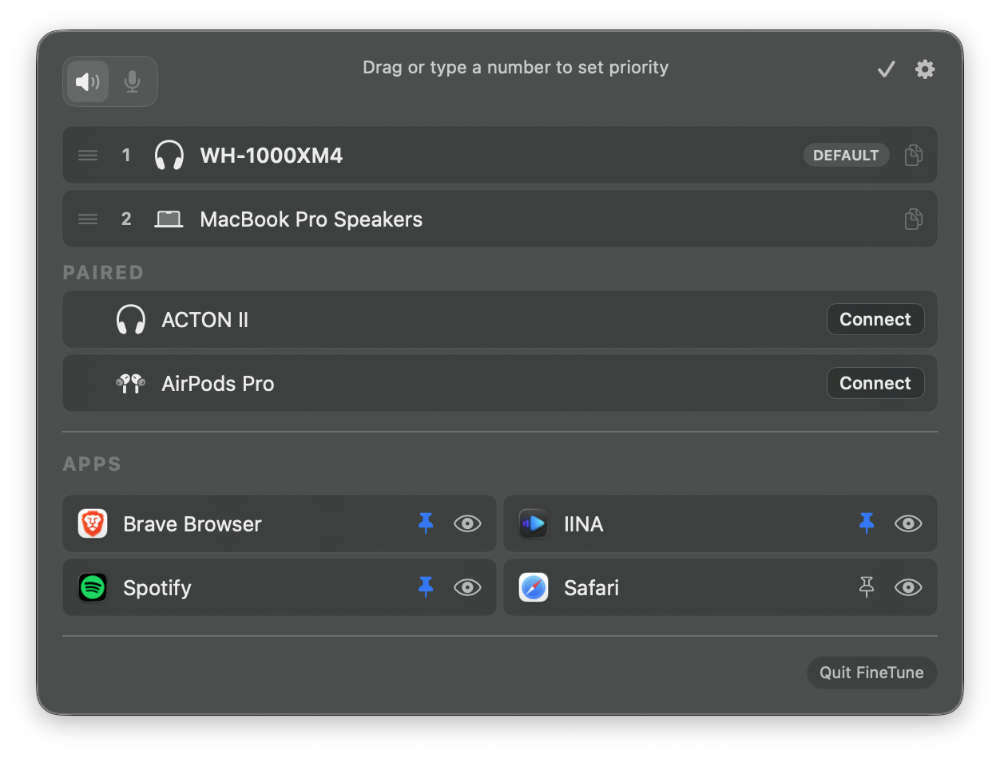

<h3>FineTune</h3>

独立控制每个应用的音量，将安静的应用音量最高提升至 4 倍，将音频路由到不同的扬声器，并通过 EQ 和耳机校正来塑造您的声音。驻留在菜单栏中。免费且开源。

<a href="https://github.com/ronitsingh10/FineTune/releases/latest/download/FineTune.dmg"></a>

<br clear="all"/>

<p align="center">
  <a href="https://github.com/ronitsingh10/FineTune/releases/latest"></a>
  <a href="https://github.com/ronitsingh10/FineTune/releases"></a>
  <a href="LICENSE"></a>
  <a href="https://ko-fi.com/ronitsingh10"></a>
  <a href="https://www.apple.com/macos/"></a>
</p>

<p align="center">
  
</p>

## 安装

**Homebrew**（推荐）

```bash
brew install --cask finetune
```

**手动安装** — [下载最新版本](https://github.com/ronitsingh10/FineTune/releases/latest)

## 快速开始

1. 安装 FineTune 并从应用程序文件夹启动
2. 在提示时授予**屏幕与系统音频录制**权限
3. 点击菜单栏中的 FineTune 图标。正在播放音频的应用会自动出现。

就是这样。在菜单栏中调整滑块、路由音频并探索 EQ。

> **提示：**想让 FineTune 在连接特定设备时自动切换到该设备？打开编辑模式（铅笔图标）并将其拖到内置扬声器上方。这是一次性设置。您偏好的顺序将被永久保存。

## 功能特性

### 🎚 音量控制
- **独立应用音量** — 每个应用程序都有独立的滑块和静音控制
- **独立应用音量增强** — 2 倍 / 3 倍 / 4 倍增益预设
- **固定应用** — 即使应用未播放，也将其保持在菜单栏中可见，以便提前配置音量、EQ 和路由
- **忽略应用** — 完全让 FineTune 与特定应用脱离。拆除音频分流，让应用恢复正常的 macOS 音频

### 🔀 音频路由
- **多设备输出** — 同时将音频路由到多个设备
- **音频路由** — 将应用发送到不同的输出设备或跟随系统默认设置
- **设备优先级** — 选择当新设备连接时 FineTune 切换到哪个设备；断开连接时自动回退
- **自动恢复** — 当设备重新连接时，应用会自动返回该设备，音量、路由和 EQ 设置完整保留

### 🎛 EQ 与校正
- **10 段 EQ** — 5 个类别下的 20 个预设
- **用户 EQ 预设** — 为每个应用保存、重命名和管理自定义 EQ 配置
- **AutoEQ 耳机校正** — 搜索数千个耳机配置文件或导入您自己的 ParametricEQ.txt 文件，进行设备频率响应校正
- **响度补偿** — 在低音量时使用 ISO 226:2023 等响度曲线自动进行低音和高音校正，配合实时电平管理以保持感知响度一致

### 🖥 设备与系统
- **输入设备控制** — 监控和调整麦克风音量
- **提示音音量** — 从设置中控制 macOS 通知和提示音量
- **软件设备音量** — 为不支持硬件音量的输出设备提供音量控制
- **蓝牙设备管理** — 直接从菜单栏连接已配对的设备
- **显示器扬声器控制** — 通过 DDC 调节外接显示器的音量
- **菜单栏应用** — 轻量级，随时可访问
- **URL 方案** — 通过脚本自动化音量、静音、设备路由等功能

## 截图

<p align="center">
  
  
</p>
<p align="center">
  
  
</p>

## 文档

- **[AutoEQ 与耳机校正](guide/autoeq.md)** — 应用来自 [AutoEQ](https://github.com/jaakkopasanen/AutoEq) 项目的频率校正，导入 [EqualizerAPO](https://sourceforge.net/projects/equalizerapo/) 配置文件，或浏览 [autoeq.app](https://www.autoeq.app/)
- **[URL 方案](guide/url-schemes.md)** — 从终端、[快捷指令](https://support.apple.com/guide/shortcuts-mac)、[Raycast](https://raycast.com) 或脚本自动化 FineTune
- **[故障排除](guide/troubleshooting.md)** — 权限问题、应用缺失、音频问题

## 参与贡献

- **给本仓库点赞** — 帮助更多人发现 FineTune
- **报告问题** — [提交 Issue](https://github.com/ronitsingh10/FineTune/issues)
- **贡献代码** — 参阅 [CONTRIBUTING.md](CONTRIBUTING.md)

### 从源码构建

```bash
git clone https://github.com/ronitsingh10/FineTune.git
cd FineTune
open FineTune.xcodeproj
```

## 系统要求

- macOS 15.0 (Sequoia) 或更高版本
- 音频捕获权限（首次启动时提示）

## 支持开发者

FineTune 永远免费且开源。如果它让您的日常更轻松，您可以请我喝杯咖啡 — 但真心不期望您这么做 🙏

[](https://ko-fi.com/ronitsingh10)


## 许可证

[GPL v3](LICENSE)